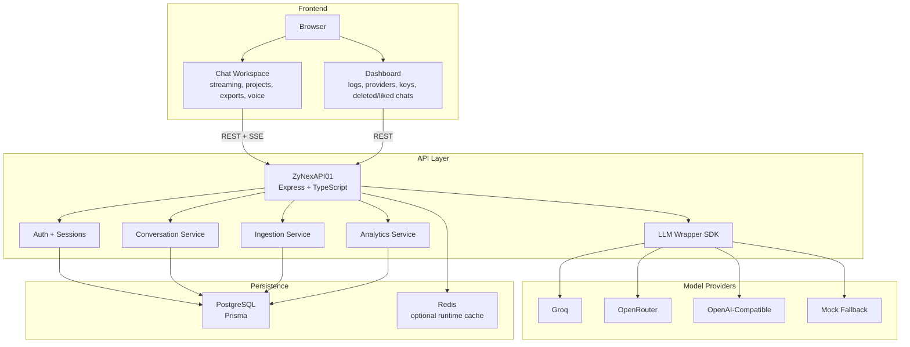
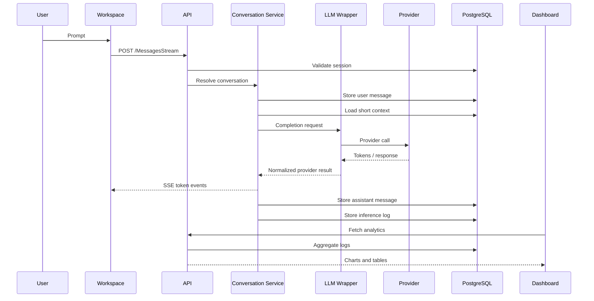
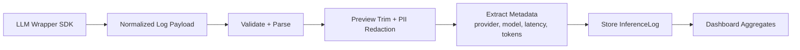
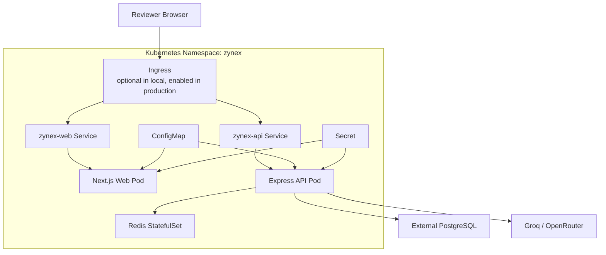

# ZyNex Architecture Notes

ZyNex is designed as a compact but production-shaped LLM application with observability built into the model-call path. The main goal is to show how a chatbot, a lightweight inference SDK, an ingestion API, and analytics storage fit together without overbuilding the system.

## High-Level Block Diagram



## Request Flow

1. The user sends a prompt from the workspace.
2. The frontend calls `MessagesStream` with the active conversation ID.
3. The API validates auth cookies and conversation ownership.
4. The API stores the user message.
5. The conversation service loads a short recent-message context window.
6. The LLM wrapper selects the provider and model.
7. The provider client calls Groq, OpenRouter, OpenAI-compatible API, or mock fallback.
8. Streaming tokens are returned to the UI through SSE.
9. The assistant message is stored.
10. The inference logger records metadata and status.
11. Dashboard routes aggregate the logs for latency, throughput, errors, and provider views.



## Inference Logging Strategy

The logging wrapper is intentionally lightweight. It does not try to become a large external observability platform. Instead, it standardizes the metadata every provider call should emit.

Captured metadata includes:

- provider
- model
- request status
- error code/message when applicable
- start and end timestamps
- latency in milliseconds
- token usage when provider returns it
- conversation ID
- session/user context
- request ID
- input preview
- output preview
- redaction events

The wrapper keeps provider integrations replaceable. Groq and OpenRouter can behave differently internally, but the rest of the application receives a normalized result and a normalized log payload.

## Ingestion Flow



The ingestion route can receive logs from internal model calls or standalone external SDK-style events. This is useful because the observability pipeline is not tightly coupled to only the chat endpoint.

## Data Model

PostgreSQL is the source of truth.

Core groups:

- Auth: users, sessions, profile data.
- Chat: conversations, messages, projects.
- Workspace state: pinned chats, liked chats, deleted-chat retention, response feedback.
- Observability: inference logs, redaction events, error events.
- Provider configuration: provider keys and selected provider/model defaults.

Design decisions:

- Messages are append-oriented so conversation history remains auditable.
- Inference logs reference conversations/messages when possible, but can also store standalone SDK events.
- Deleted chats are retained for 30 days before full purge.
- Provider keys are API-backed for assessment usability; production should encrypt them with KMS.
- Analytics are read from PostgreSQL for this compact implementation; ClickHouse is the next step for higher log volume.

## Frontend Architecture

The frontend is a Next.js application with two primary surfaces:

- Workspace: chat, model selection, attachments, code/document/table rendering, exports, voice input, response actions, and conversation management.
- Dashboard: profile, conversations, inference logs, providers, deleted chats, liked chats, API keys, security, sessions, and settings.

The UI avoids local-storage-only state for core user data. Conversations, projects, pinned state, liked chats, deleted chats, and API keys are backed by API/database calls.

## Deployment Architecture

### Public Demo

The stable public demo is available at:

```txt
https://zynex.zyfrr.com
```

This is the URL reviewers can use without needing our laptop or a temporary tunnel.

### Kubernetes Support

The Kubernetes implementation is stored under `infra/k8s` and deploys:

- `zynex-web` Deployment and Service.
- `zynex-api` Deployment and Service.
- `zynex-redis` StatefulSet and Service.
- ConfigMap for non-secret runtime config.
- Secret for database, auth, provider, and email credentials.
- Optional ingress for `zynex.zyfrr.com` and `api.zynex.zyfrr.com`.



### Local Kubernetes Validation

Docker Desktop Kubernetes was used because a no-cost production VPS was not available without billing risk.

Validated items:

- API pod ready and health check passing.
- Web pod reachable through port-forward.
- Redis StatefulSet running.
- Auth email start and verify flows working with console OTP.
- Auth cookies set correctly for localhost.
- Conversation/project APIs called from the web pod.
- Streaming chat endpoint reached successfully.

Observed successful chat request:

```txt
POST /api/v1/chat/ZyNexAPI01ChatConversations/:id/MessagesStream
Status: 200
Content-Type: text/event-stream
```

## Failure Handling

- Provider errors are captured as failed inference logs before being returned to the UI.
- API key exhaustion or invalid keys trigger user-facing workspace guidance.
- Missing provider keys can fall back to server env keys or mock provider.
- Deleted chats are recoverable for 30 days.
- Cancelled conversations reject new messages.
- Local email can run in console mode when SMTP/Resend is not configured.

## Scaling Considerations

Near-term scale:

- Add a queue for inference log ingestion.
- Move analytics-heavy queries to ClickHouse.
- Add Kubernetes HPA after metrics-server.
- Move migrations into a Kubernetes Job before scaling API replicas.
- Add object storage for generated exports and attachments.

Security scale:

- Encrypt provider keys with KMS.
- Move Kubernetes secrets into External Secrets or a cloud secret manager.
- Add stricter PII redaction policies.
- Add audit logs for provider-key changes.

Testing scale:

- Add Playwright coverage for desktop/mobile chat flows.
- Add API contract tests for ingestion payloads.
- Add smoke tests for Kubernetes health and chat streaming.

## Tradeoffs

- PostgreSQL is used for both chat state and observability in this assessment version to keep setup simple.
- ClickHouse is planned but not required for the current traffic level.
- Browser speech recognition avoids paid speech-to-text APIs.
- Browser export paths keep document/PDF features lightweight.
- Local Kubernetes validation is used instead of an unpaid production VPS because reliable free Kubernetes hosting generally requires billing details.

## Outcome Against Assessment

ZyNex satisfies the core assessment requirements:

- Chatbot with multi-turn conversations and short context.
- Foundation model integration through Groq/OpenRouter/OpenAI-compatible providers.
- Lightweight SDK/wrapper around LLM calls.
- Near-real-time inference logging.
- Ingestion API with validation and parsing.
- Database storage for messages, inference logs, and metadata.
- Architecture notes, README, setup instructions, tradeoffs, and demo link.

It also implements many bonus items:

- Multi-provider support.
- Streaming responses.
- Latency, throughput, and error dashboards.
- Docker Compose setup.
- PII redaction events.
- Kubernetes Helm deployment support.
- Conversation cancel/list/resume.
- Rich frontend response actions and exports.
