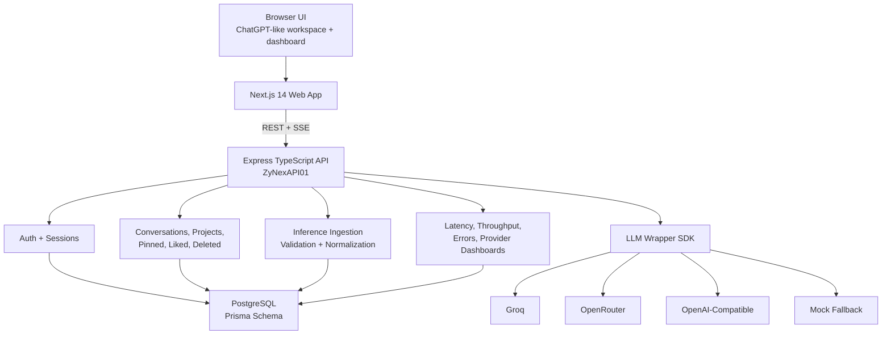
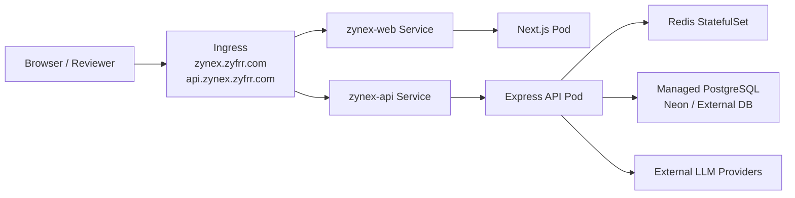
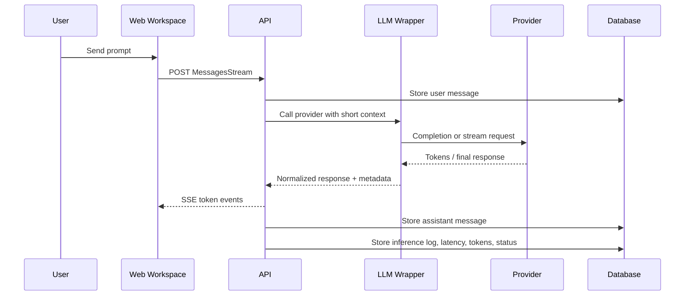

# ZyNex Architecture Notes

## System Overview

## Kubernetes Deployment Shape

## Ingestion Flow

1. A user sends a message from the Next.js workspace.
2. The workspace creates or resumes a conversation through the API.
3. The chat route stores the user message and builds a short context window from recent messages.
4. The provider wrapper calls Groq, OpenRouter, OpenAI-compatible APIs, or the mock fallback.
5. Streaming calls emit SSE `token` events to the frontend and finish with a `done` event containing saved message and log metadata.
6. `InferenceLogger` writes provider, model, latency, token usage, status, request ID, conversation ID, input/output previews, redaction events, and error events.
7. Analytics routes aggregate the stored logs for dashboard charts and tables.

## Logging Strategy

The logging wrapper is deliberately small. Provider clients return normalized completion data, while `InferenceLogger` owns redaction, preview trimming, token totals, and error capture. This keeps provider integrations replaceable without changing ingestion or dashboard code.

## Persistence

PostgreSQL stores auth, sessions, profiles, conversations, messages, projects, pinned state, liked chats, deleted-chat retention metadata, provider keys, response feedback, inference logs, redaction events, and error events. User-facing state is API-backed rather than browser local storage.

## Implemented Outcomes

- Multi-turn chatbot with short context and streaming SSE responses.
- Provider wrapper around Groq, OpenRouter, OpenAI-compatible APIs, and mock fallback.
- Inference metadata capture for provider, model, latency, token usage, timestamps, status, request ID, conversation/session ID, previews, redaction, and errors.
- API-backed chat messages, projects, pinned chats, liked chats, deleted chat retention, provider keys, and response feedback.
- Dashboard views for inference logs, providers, API keys, deleted chats, liked chats, security, sessions, and settings.
- Export support for document-like responses, tables, and code-oriented outputs.
- Docker Compose and Kubernetes Helm deployment paths.
- Local Kubernetes validation completed on Docker Desktop Kubernetes using web/API services and Redis.

## Scaling Considerations

- Move inference logs to a queue when write volume grows.
- Send analytics to ClickHouse for high-cardinality latency, token, and provider queries.
- Keep PostgreSQL as the source of truth for user/chat state.
- Use SSE for current streaming; WebSockets can be added if collaborative real-time workflows become necessary.
- Partition or archive inference logs by date for long-running production deployments.

## Failure Handling

- Provider errors are captured as failed inference logs.
- API key and quota failures surface in the workspace with a link to the API Keys dashboard page.
- Deleted chats remain archived for 30 days, then purge related messages, logs, redaction events, and error events.
- Missing provider keys fall back to server env keys or the mock provider when applicable.

## Tradeoffs

- Browser speech recognition is used for voice input to avoid adding a paid speech API dependency.
- PDF export uses browser print/save to avoid a heavy PDF-rendering dependency.
- Provider keys are stored through the API for the assessment workflow; a production deployment should encrypt them with a managed KMS.
- The public demo remains hosted on the existing always-available deployment, while Kubernetes was validated locally because no free production VPS was available without billing risk.
