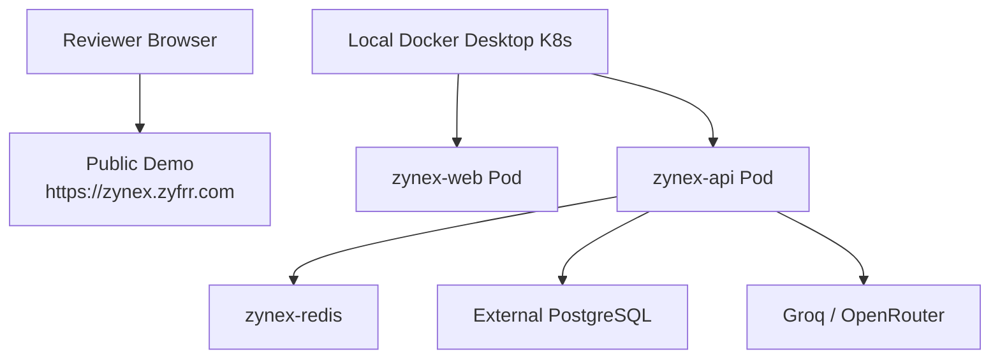

# ZyNex Kubernetes Deployment Guide

This guide deploys ZyNex as two application workloads:

- `zynex-web`: Next.js frontend served at `https://zynex.zyfrr.com`
- `zynex-api`: Express API served at `https://api.zynex.zyfrr.com`

The chart also includes an optional Redis StatefulSet. PostgreSQL is recommended as a managed database.

## Validation Status

This chart was validated on Docker Desktop Kubernetes with:

- `zynex-web` Deployment
- `zynex-api` Deployment
- `zynex-redis` StatefulSet
- local service routing through `kubectl port-forward`
- login OTP in console mode
- API-backed conversations/projects
- streaming chat through `text/event-stream`

The public demo remains hosted separately at `https://zynex.zyfrr.com` so reviewers have an always-available link even without a paid VPS.



## 1. Prerequisites

- Kubernetes cluster
- `kubectl`
- `helm`
- Container registry access, for example GHCR, Docker Hub, ECR, or GCR
- Ingress controller, usually `ingress-nginx`
- TLS support, usually `cert-manager`
- Managed PostgreSQL connection string

## 2. Build Images

Replace the registry names with your own registry.

```bash
docker build -f Dockerfile.api -t ghcr.io/your-org/zynex-api:latest .
docker build -f Dockerfile.web \
  --build-arg NEXT_PUBLIC_ZYNEX_API_URL=https://api.zynex.zyfrr.com \
  --build-arg NEXTAUTH_URL=https://zynex.zyfrr.com \
  -t ghcr.io/your-org/zynex-web:latest .
```

`NEXTAUTH_SECRET` is intentionally provided at runtime through the Kubernetes Secret, not as a Docker build argument.

## 3. Push Images

```bash
docker push ghcr.io/your-org/zynex-api:latest
docker push ghcr.io/your-org/zynex-web:latest
```

## 4. Prepare Values

Copy the sample values file and edit it.

```bash
cp infra/k8s/values.yaml infra/k8s/values.prod.yaml
```

`values.prod.yaml` is ignored by Git because it contains real secrets.

Update:

- `images.web.repository`
- `images.api.repository`
- `secrets.DATABASE_URL`
- `secrets.ZYNEX_JWT_SECRET`
- `secrets.NEXTAUTH_SECRET`
- `secrets.GROQ_API_KEY`
- `secrets.OPENROUTER_API_KEY`
- SMTP or Resend settings if email delivery is enabled

Production cookie values:

```yaml
api:
  env:
    ZYNEX_COOKIE_DOMAIN: .zyfrr.com
    ZYNEX_COOKIE_SECURE: "true"
    WEB_ORIGIN: https://zynex.zyfrr.com

web:
  env:
    NEXT_PUBLIC_ZYNEX_API_URL: https://api.zynex.zyfrr.com
    NEXTAUTH_URL: https://zynex.zyfrr.com
```

## 5. Install Ingress and TLS Tools

If your cluster already has ingress and TLS, skip this step.

```bash
helm repo add ingress-nginx https://kubernetes.github.io/ingress-nginx
helm repo add jetstack https://charts.jetstack.io
helm repo update

helm upgrade --install ingress-nginx ingress-nginx/ingress-nginx \
  --namespace ingress-nginx \
  --create-namespace

helm upgrade --install cert-manager jetstack/cert-manager \
  --namespace cert-manager \
  --create-namespace \
  --set installCRDs=true
```

Create a TLS secret manually or use cert-manager. The chart expects:

```txt
zynex-tls
```

## 6. Deploy ZyNex

```bash
helm upgrade --install zynex ./infra/k8s \
  --namespace zynex \
  --create-namespace \
  -f infra/k8s/values.prod.yaml
```

## Local Docker Desktop Validation

Use this path when validating without a paid VPS:

```bash
helm upgrade --install zynex ./infra/k8s \
  --namespace zynex \
  --create-namespace \
  -f infra/k8s/values.prod.yaml \
  --set ingress.enabled=false \
  --set api.env.WEB_ORIGIN=http://localhost:3000 \
  --set web.env.NEXT_PUBLIC_ZYNEX_API_URL=http://localhost:4101 \
  --set web.env.NEXTAUTH_URL=http://localhost:3000 \
  --set api.env.ZYNEX_COOKIE_DOMAIN="" \
  --set api.env.ZYNEX_COOKIE_SECURE=false
```

Then port-forward in two separate terminals:

```bash
kubectl port-forward -n zynex svc/zynex-web 3000:3000
kubectl port-forward -n zynex svc/zynex-api 4101:4101
```

Smoke test:

```txt
http://localhost:3000
http://localhost:4101/api/v1/health/ZyNexAPI01HealthCheck
```

If email delivery is not configured locally, OTP codes are printed in API logs:

```bash
kubectl logs -n zynex deployment/zynex-api --tail=120
```

## 7. Verify Pods

```bash
kubectl get pods -n zynex
kubectl get svc -n zynex
kubectl get ingress -n zynex
```

Check API logs:

```bash
kubectl logs deployment/zynex-api -n zynex
```

Check web logs:

```bash
kubectl logs deployment/zynex-web -n zynex
```

## 8. DNS Setup

Point both domains to the ingress load balancer:

```txt
zynex.zyfrr.com      -> ingress external IP or CNAME
api.zynex.zyfrr.com  -> ingress external IP or CNAME
```

## 9. Smoke Test

Open:

- `https://zynex.zyfrr.com`
- `https://api.zynex.zyfrr.com/api/v1/health/ZyNexAPI01HealthCheck`

Then test:

1. Sign up or log in.
2. Send a chat message.
3. Confirm streaming response.
4. Open dashboard.
5. Confirm inference logs and provider metrics appear.

## 10. Scaling

Scale the web safely:

```bash
kubectl scale deployment/zynex-web -n zynex --replicas=2
```

Scale the API after confirming Prisma migrations are stable:

```bash
kubectl scale deployment/zynex-api -n zynex --replicas=2
```

For higher scale, move migrations into a dedicated Kubernetes Job and remove migration execution from the API container startup command.

## Production Notes

- Use managed PostgreSQL instead of an in-cluster Postgres for production.
- Store real secrets using an external secret manager where possible.
- Provider keys should be encrypted with KMS before long-term production use.
- Add queue-backed ingestion if inference traffic grows.
- Use HPA after metrics-server is installed.
